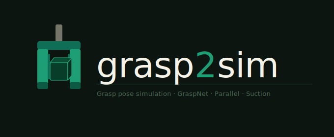

<p align="center">
  
</p>

# grasp2sim

A MuJoCo-based simulation framework for evaluating **6-DoF grasp poses** from the [GraspNet-1Billion](https://graspnet.net) dataset using a Franka Emika Panda gripper.

## Overview

`Grasp2sim` bridges the GraspNet dataset and physics simulation. Given a set of 6D grasp poses $G = [R \mid t ]$ — where $R \in \mathbb{R}^{3 \times 3}$ is the gripper orientation, $t \in \mathbb{R}^{3}$ the grasp center — it simulates each grasp and evaluates success based on a **lift height** threshold $\Delta z \geq 0.08\,\text{m}$.

## How It Works

1. **Scene generation** (`scenes/grasp2scene_mocap.py`): reads object 6D poses from GraspNet annotations and generates a MuJoCo XML scene with dynamic objects and a kinematic Panda hand.

2. **Grasp filtering** (`utils/poses.py`): loads grasp labels, filters by width and approach angle, then builds a `GraspGroup` sorted by score.

3. **Simulation** (`sim/grasp_sim_mocap.py`): for each grasp pose, transforms it from camera frame to world frame and executes an approach → close → retreat → lift sequence. Success is determined by $\Delta z \geq 0.08\,\text{m}$ of the target object post-lift.

## Usage

### Step 1 — Generate a scene XML

```bash
python scenes/grasp2scene_mocap.py --coacd
```

Key options: `--scene-dir`, `--model-dir`, `--output-xml`, `--obj-indexes`, `--strength {original,strong}`.

### Step 2 — Run the experiment suite

```bash
python run_experiments.py
```

Runs two experiments per object — **individual** (object in isolation) and **combined** (all objects together) — and writes results to `OUTPUT_DIR/`.

Key options:

| Flag | Default | Description |
|---|---|---|
| `--top-n` | 10 | Top-N grasps per object to test |
| `--executor` | `descend` | Execution strategy (`descend` or `teleport`) |
| `--obj-ids` | all | Restrict to specific object IDs |
| `--no-individual` / `--no-combined` | — | Skip one experiment type |
| `--video` | off | Record and save MP4s |

Outputs written to `OUTPUT_DIR/`:
- `results.csv` — one row per grasp trial
- `summary.json` — per-object and overall success rates
- `individual/` / `combined/` — contact and orientation plots for failures

### Step 3 — Run the simulator standalone (optional)

```bash
python sim/grasp_sim_mocap.py --scene-xml outputs/scenes/scene_0000_mocap.xml \
                               --object-id 5 --top 20 --grasp-debug
```

## Grasp Evaluation

Each grasp is classified into one of:

| Outcome | Meaning |
|---|---|
| `ok` | Target object lifted ≥ 0.08 m |
| `no_contact_at_close` | Fingers never seated on the target |
| `lost_during_retreat` | Seated but slipped before lift |
| `slipped_during_lift` | Held through retreat but lost during lift |
| `wrong_object_lifted` | Held target but a different object was lifted (combined mode) |

## Notes

- Rendering uses EGL offscreen (`MUJOCO_GL=egl`) for headless environments.
- `scenes/grasp2scene_mocap.py` and `sim/grasp_sim_mocap.py` are self-contained: they load `.env` themselves via `find_dotenv()` and can be used outside the repo without any local imports.